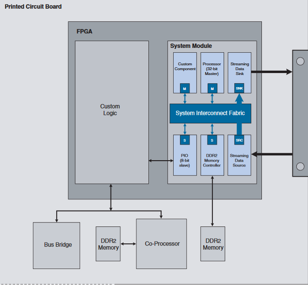
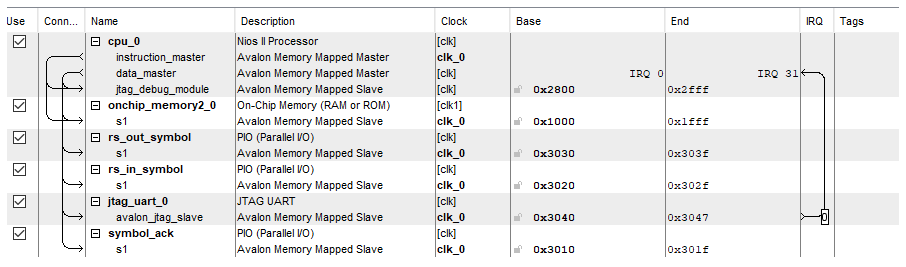
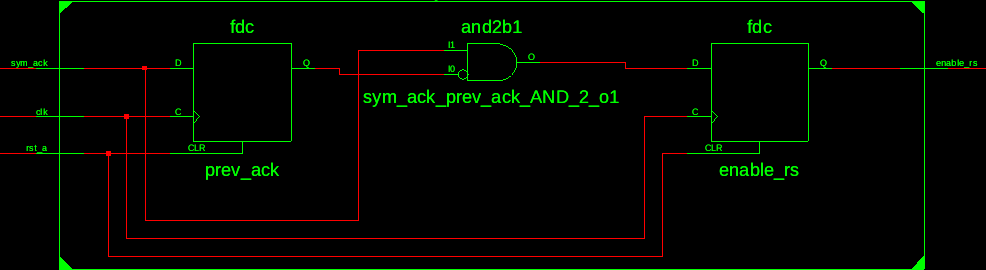
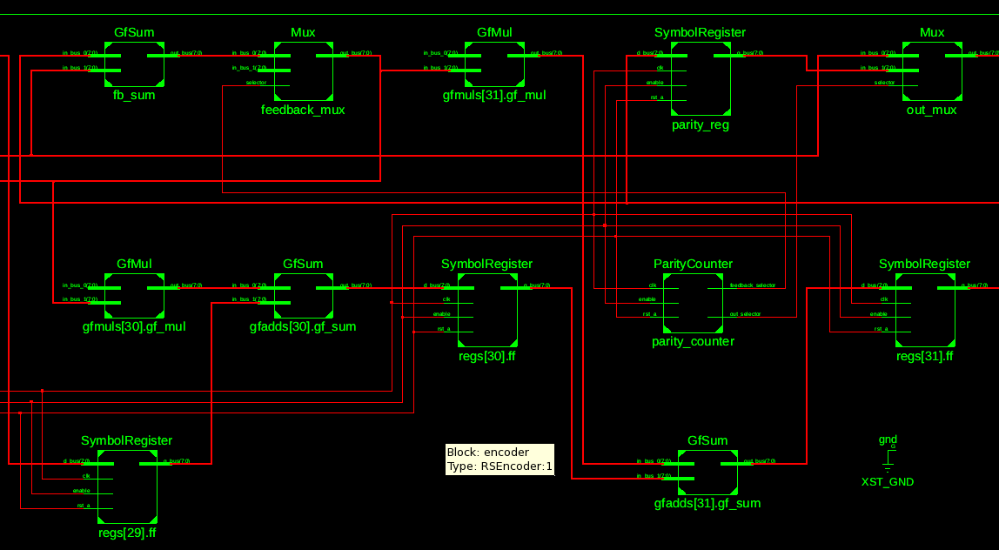

# Reed Solomon encoder attraverso il modulo UART - JTAG

## Index
.................................................

## 1. Introduzione
Target board: Altera CycloneII - EP2C20F484C7

N: 255
K: 223
T: 16
M: 8

Primitive polynomial: p(x) = 285

Generator polynomial: g(z) =
    45 + 216z + 239z<sup>2</sup> + 24z<sup>3</sup> + 253z<sup>4</sup> + 104z<sup>5</sup> + 27z<sup>6</sup> + 40z<sup>7</sup> + 107z<sup>8</sup> + 50z<sup>9</sup> + 163z<sup>10</sup> + 210z<sup>11</sup> + 227z<sup>12</sup> + 134z<sup>13</sup> +
    224z<sup>14</sup> + 158z<sup>15</sup> + 119z<sup>16</sup> + 13z<sup>17</sup> + 158z<sup>18</sup> + z<sup>19</sup> + 238z<sup>20</sup> + 164z<sup>21</sup> + 82z<sup>22</sup> + 43z<sup>23</sup> + 15z<sup>24</sup> + 232z<sup>25</sup> +
    246z<sup>26</sup> + 142z<sup>27</sup> + 50z<sup>28</sup> + 189z<sup>29</sup> + 29z<sup>30</sup> + 232z<sup>31</sup> + z<sup>32</sup>

## 2. Reed Solomon
Reed Solomon è un codice a correzione di errore usato in molte applicazioni: dalle comunicazioni dei satelliti ai codici a barre ai CDROM.

Un codice RS è un codice a correzione di  errore ciclico che usa pattern di simboli invece che di bit per trasmettere e ricevere messaggi.

Ogni simbolo è costituito da m bit e la relazione tra bit e simboli viene fatta attraverso la teoria dei Campi Finiti.
### 2.1 Campi finiti di Galois
In matematica, un campo è un insieme di elementi nel quale sono definite le operazioni di somma e prodotto. Queste operazioni sono commutative, associative e chiuse, ovvero che il risultato dell’operazione tra due elementi qualunque dell’insieme è ancora appartenete all’insieme.

Un campo ha anche valori identità alla somma e prodotto, da cui deriva che gli elementi di un campo hanno inversi additivi e moltiplicativi.

I campi finiti di Galois esistono con m elementi per ogni  p primo: dato che i numeri binari possono essere rappresentati con 2 valori possibili (0 o 1) e che 2 è un numero primo, è possibile trovare un campo finito per un insieme di numeri binari.

## 3. Convenzioni e principi di design utilizzati
### 3.1 Organizzazione del codice
- Entities, architectures e configurations dello stesso design appartengono allo stesso file `<DesignName>.vhd`
- Constants e paramenters dello stesso design appartengono allo stesso file `<DesignName>_parameters.vhd`
#### Convenzione dei nomi
- nomi lowercase per: segnali, variabili, nomi di porte
- nomi UPPERCASE per: costanti, typi, processi
- in particolare
  - segnali di Clock: `clk_*`
  - segnali di Reset: `rst`
  - segnali asincroni signal: `*_a`
- nomi di processi: `*_PROC`
- ordinamento nei bus multibit: `x down to 0`
#### Ordinamento dei segnali
- Prima segnali input, seguiti dagli output
- con il seguente ordine:
  - Clocks
  - Resets
  - Enables
  - Control signals
  - Datapath signals
### 3.2 Principi di design
- Mantenere lo schema di clock e la struttura del design semplice
- Utilizzare in modo consistente le convenzioni
- Evitare la logica asincrona
- preferire l'uso dei segnali alle variabili per ottenere simulazioni più realistiche
- preferire un singolo statement `switch case` rispetto a degli `if-else` innestati
- Utiizzo di `delay` e `wait until` solo nelle simulazioni
- Registrare tutti gli output di un componente
- Evitare valori hard-coded, usare costanti
- Evitare latches (sono permessi in register files, memorie, FIFOs)
  - assegnando l'output per tutte le possibili condizioni di input
  - evitando combinational feedback
- La definizione del package e delle costanti è in un file separato
- Isolare i componenti specifici di una board in moduli separati
#### Librerie
- Usare solo `IEEE` libraries per la massima compatibilità
- Usare `std_logic` invece di `std_ulogic` or `bit` (i primi forniscono three-state)
#### Clocks e resets
- Non usare clocks e resets generati internamente
- Evitare clock gating (è comprensibile solo per motivi di power efficiency)
- Usare 2 flip-flop in cascata per trasferire singoli bit (non bus) da un dominio di clock all'altro

## 4. Encoder Hardware design
Il sistema è stato progettato in modo da poter cambiare i parametri che sono localizzati in un unico file (`ReedSolomon_package`) senza dover modificare altri sorgenti.


Top level module:
```vhdl
library ieee;
use ieee.std_logic_1164.all;
use work.ReedSolomon_package.all;

entity ReedSolomon is port(
    CLOCK_50: in std_logic;
    KEY : in std_logic_vector(0 downto 0));
end entity;

architecture RTL of ReedSolomon is
    component HostBridge is port(
        clk_0: in std_logic;
        reset_n: in std_logic;
        out_port_from_the_rs_in_symbol: out std_logic_vector (7 downto 0);
        in_port_to_the_rs_out_symbol: in std_logic_vector (7 downto 0);
        out_port_from_the_symbol_ack: out std_logic);
    end component;
    component Synchronizer is port (
    	clk: in std_logic;
    	rst_a: in std_logic;
    	sym_ack: in std_logic;
    	enable_rs: out std_logic);
    end component;
    component RSEncoder is port(
    	clk: in std_logic;
    	rst_a: in std_logic;
    	enable: in std_logic;
    	in_bus: in data_bus;
    	out_bus: out data_bus);
    end component;
    signal uart_symbol_in: data_bus;
    signal uart_symbol_out: data_bus;
    signal uart_symbol_ack: std_logic;
    signal enable_rs: std_logic;

begin
    host_uart: HostBridge port map(CLOCK_50, KEY(0), uart_symbol_in, uart_symbol_out, uart_symbol_ack);
    sync: Synchronizer port map(CLOCK_50, not KEY(0), uart_symbol_ack, enable_rs);
    encoder: RSEncoder port map(CLOCK_50, not KEY(0), enable_rs, uart_symbol_in, uart_symbol_out);
end architecture;
```

RSEncoder:
```vhdl
signal feedback_selector: std_logic;
    signal out_selector: std_logic;
    signal parity_symbol: data_bus;
    signal feedback: data_bus;
    signal sum: data_bus;
    signal ffd: parity_bus;
    signal ffq: parity_bus;
    signal products: parity_bus;

begin
    regs: for i in 0 to parity_bus'length-1 generate
    	ff: SymbolRegister port map(clk, rst_a, enable, ffd(i), ffq(i));
    end generate;
    gfmuls: for i in 0 to parity_bus'length-1 generate
    	gf_mul: GfMul port map(generator_polynomial(i), feedback, products(i));
    end generate;

    ffd(0) <= products(0);
    gfadds: for i in 1 to parity_bus'length-1 generate
    	gf_sum: GfSum port map(products(i), ffq(i-1), ffd(i));
    end generate;

    fb_sum: GfSum port map(ffq(parity_bus'length-1), in_bus, sum);

    parity_reg: SymbolRegister port map(clk, rst_a, enable, ffq(parity_bus'length-1), parity_symbol);

    parity_counter: ParityCounter port map(rst_a, clk, enable, out_selector, feedback_selector);
    feedback_mux: Mux port map(sum, (others => '0'), feedback_selector, feedback);
    out_mux: Mux port map(in_bus, parity_symbol, out_selector, out_bus);
end architecture;
```

Galois multiplier
```vhdl
entity GfMul is port(
    in_bus_0: in data_bus;
    in_bus_1: in data_bus;
    out_bus: out data_bus);
end entity;

architecture RTL of GfMul is
    component AdderModulo is port(
    	in_bus_0: in data_bus;
    	in_bus_1: in data_bus;
    	out_bus: out data_bus);
    end component;
    component Mux is port(
        in_bus_0: in data_bus;
        in_bus_1: in data_bus;
        selector: in std_logic;
        out_bus: out data_bus);
    end component;
    component SymbolPowerEncoder is port(
        in_pow: in data_bus;
        out_enc: out data_bus);
    end component;
    component SymbolPowerDecoder is port(
        in_pow: in data_bus;
        out_dec: out data_bus);
    end component;

    constant all_zeros: data_bus := (others => '0');

    signal encoded_0: data_bus;
    signal encoded_1: data_bus;
    signal is_zero: std_logic;
    signal to_decode: data_bus;
    signal decoded: data_bus;

begin
    encode_0: SymbolPowerEncoder port map(in_bus_0, encoded_0);
    encode_1: SymbolPowerEncoder port map(in_bus_1, encoded_1);

    adder_modulo: AdderModulo port map(encoded_0, encoded_1, to_decode);
    decode: SymbolPowerDecoder port map(to_decode, decoded);

    is_zero <= '1' when (in_bus_0 = all_zeros) or (in_bus_1 = all_zeros) else '0';
    zero_mux: Mux port map(decoded, all_zeros, is_zero, out_bus);
end architecture;
```

Package:
```vhdl
package ReedSolomon_package is
    constant N: integer := 255;
    constant K: integer := 223;
    constant M: integer := 8;
    constant gf_overflow: integer := 2**M-2;

    subtype data_bus is std_logic_vector(M-1 downto 0);
    type parity_bus is array(N-K-1 downto 0) of data_bus;

    constant generator_polynomial : parity_bus := (
        "01110100",
        "01000000",
        "00110100",
        "10101110",
        "00110110",
        "01111110",
        "00010000",
        "11000010",
        "10100010",
        "00100001",
        "00100001",
        "10011101",
        "10110000",
        "11000101",
        "11100001",
        "00001100",
        "00111011",
        "00110111",
        "11111101",
        "11100100",
        "10010100",
        "00101111",
        "10110011",
        "10111001",
        "00011000",
        "10001010",
        "11111101",
        "00010100",
        "10001110",
        "00110111",
        "10101100",
        "01011000");
```

Parity counter:
```vhdl
entity ParityCounter is port(
    rst_a: in std_logic;
    clk: in std_logic;
    enable: in std_logic;
    out_selector: out std_logic;
    feedback_selector: out std_logic);
end entity;

architecture RTL of ParityCounter is
    signal counter: data_bus;
begin
    process(clk, rst_a) begin
        if(rst_a = '1') then
            counter <= (others => '0');
            feedback_selector <= '0';
            out_selector <= '0';
        elsif(rising_edge(clk)) then
            if enable = '1' then
            	counter <= std_logic_vector(unsigned(counter)+1);
            	if to_integer(unsigned(counter)) = K then
            	    out_selector <= '1';
            	elsif to_integer(unsigned(counter)) = K-1 then
            	    feedback_selector <= '1';
            	elsif to_integer(unsigned(counter)) = N then
            	    feedback_selector <= '0';
            	    out_selector <= '0';
            	    counter <= (others => '0');
            	end if;
            end if;
        end if;
    end process;
end architecture;
```
___
## 5. Comunicazione PC - FPGA
La comunicazione tra PC (host) e FPGA consiste in uno stream seriale di caratteri e avviene tramite il modulo JTAG che permette di inviare e ricevere dati usando il protocollo UART.

L’FPGA Altera contiene un circuito di controllo tra i pin JTAG del dispositivo e la logica interna.
Il dispositivo viene connesso al PC tramite il cavo USB di download, per essere riconosciuto dall’ host è necessario che quest’ultimo installi i driver dell’USB Blaster di altera, che permettono di interfacciarsi con il JTAG server presente sulla scheda.



Il modulo SOCP(system-on-a-programmable-chip) builder messo a disposizione dall’ide Quartus II permette di definire un sistema complesso partendo da un diagramma a blocchi. Tra gli IP cores disponibili è stato usato il modulo Nios2, ovvero un processore RISC a 32 bit (circa 700 LEs) che eseguirà le istruzioni necessarie per interfacciare la rete con il modulo JTAG UART.
```c
#include "sys/alt_stdio.h"

#define rs_out (volatile char *) 0x0003030
#define rs_in (volatile char *) 0x0003020
#define ack (volatile char *) 0x0003010

int main() {
    int i;
    for (i = 0; i < 223; i++) {
        *rs_in = alt_getchar();
        *ack = 1; *ack = 0;
        alt_printf("%s\n", itoa(*rs_out));
    }
    *ack = 1; *ack = 0;
    for (i = 0; i < 32; i++) {
        alt_printf("%s\n", itoa(*rs_out));
        *ack = 1; *ack = 0;
    }
    return 0;
}
```
Per compilare il sorgente in un .elf eseguibile dal processore NiosII è sufficiente lanciare il comando `make mem_init_generate`

Altera mette a disposizione una command-line utility: `nios2-terminal` che apre una sessione terminale con il core JTAG UART, occupandosi della gestione della connessione e della decodifica dello stream dei dati mostrandoli a schermo.

Un'altra utility messa a disposizione da Altera è l'applicazione `jtagconfig` che mostra le informazioni dei dispositivi connessi all'host tramite l'interfaccia JTAG.

Una volta programmate l'FPGA con il design generato, è necessario caricare l'eseguibile nella memoria rom connessa con il processore attraverso il comando `nios2-download`.



I driver del dispositivo sono forniti dalla libreria di sistema HAL (Hardware Abstraction Layer) che viene generata a partire dal design del sistema SOPC, la quale permette di interfacciarsi con il core JTAG UART attraverso chiamate a funzioni della libreria ANSI C stdio.h.

I sorgenti VHDL generati che costituiscono il processore NIOS2 e il modulo JTAG-UART vengono inclusi nella entità principale del progetto
```vhdl
component HostBridge is port(
    clk_0: in std_logic;
    reset_n: in std_logic;
    out_port_from_the_rs_in_symbol: out std_logic_vector (7 downto 0);
    in_port_to_the_rs_out_symbol: in std_logic_vector (7 downto 0);
    out_port_from_the_symbol_ack: out std_logic);
end component;
```
Synchronizer:
```vhdl
entity Synchronizer is port (
    clk: in std_logic;
    rst_a: in std_logic;
    sym_ack: in std_logic;
    enable_rs: out std_logic);
end entity;

architecture RTL of Synchronizer is
    signal prev_ack: std_logic;
begin
    process (clk) begin
        if (rst_a = '1') then
            prev_ack <= '0';
            enable_rs <= '0';

        elsif (rising_edge(clk)) then
            enable_rs <= '0';
            if sym_ack = '1' and prev_ack = '0' then
            	enable_rs <= '1';
            end if;
            prev_ack <= sym_ack;
        end if;
    end process;
end architecture;
```
Synchronizer schematic



