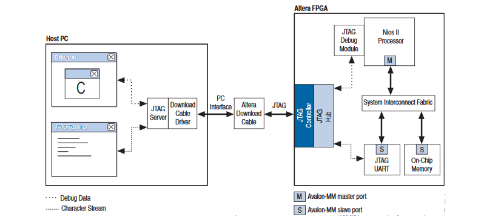

# Host communication

## Intro: USB - JTAG - UART

The JTAG UART core implements a method to communicate serial character streams between a host PC and an SOPC Builder system on an Altera FPGA.

Altera FPGAs contain built-in JTAG control circuitry between the device's JTAG pins and the logic inside the device. The JTAG controller on the FPGA and the download cable driver on the host PC implement a simple data-link layer between host and target. All JTAG nodes inside the FPGA are multiplexed through the single JTAG connection. JTAG server software on the host PC controls and decodes the JTAG data stream, and maintains distinct connections with nodes inside the FPGA. The example system in figure contains one JTAG UART core and a Nios II processor. Both agents communicate with the host PC over a single Altera download cable. Thanks to the JTAG server software, each host application has an independent connection to the target. Altera provides the JTAG server drivers and host software required to communicate with the JTAG UART core.

Host software is necessary for a PC to access the JTAG UART core. The Nios II IDE supports the JTAG UART core, and displays character I/O in a console window. Altera also provides a command-line utility called nios2-terminal that opens a terminal session with the JTAG UART core.

## Steps

1. Use SOCP builder to generate entities that allows host communication via jtag - uart

    The JTAG UART core uses the JTAG circuitry built in to Altera FPGAs, and provides host access via the JTAG pins on the FPGA. The host PC can connect to the FPGA via any Altera JTAG download cable, such as the USB-Blaster™ cable. Software support for the JTAG UART core is provided by Altera.

    For the Nios II processor, device drivers are provided in the HAL system library, allowing software to access the core using the ANSI C Standard Library stdio.h routines. For the host PC, Altera provides JTAG terminal software that manages the connection to the target, decodes the JTAG data stream, and displays characters on screen.The JTAG UART core is SOPC Builder-ready and integrates easily into any SOPC Builder-generated system.

    SOPC Builder is a powerful system development tool. SOPC Builder enables you to define and generate a complete system-on-a-programmable-chip (SOPC) in much less time than using traditional, manual integration methods. SOPC Builder is included as part of the Quartus II software.

    

2. Include the generated IP core in the HDL design.

3. Start compilation

4. Program (loading .sof generated) the FPGA with the RUN/PROG switch in RUN mode

5. Command line utils (use to check that everything is working properly)

    - `jtagconfig`
    This command returns information about the devices connected to your host PC through the JTAG interface, for your use in debugging or programming. Use this command to determine if you configured your FPGA correctly.

    - `nios2-terminal`
    This command establishes contact with stdin, stdout, and stderr in a Nios II processor subsystem. stdin, stdout, and stderr are routed through a UART (standard UART or JTAG UART) module within this system.

6. From Nios2 Eclipse, create new BSP project from template choosing HelloWorld Small or set Optimization level -> 2 in project settings.

7. `make mem_init_generate` this will generate a .ELF file containing the .text region (the instuctions) that the Nios2 will execute at runtime

8. Run as > Nios2 Hardware

    or

    `nios2-download`
    This command parses Nios II .elf files, downloads them to a functioning Nios II processor, and optionally runs the .elf file
